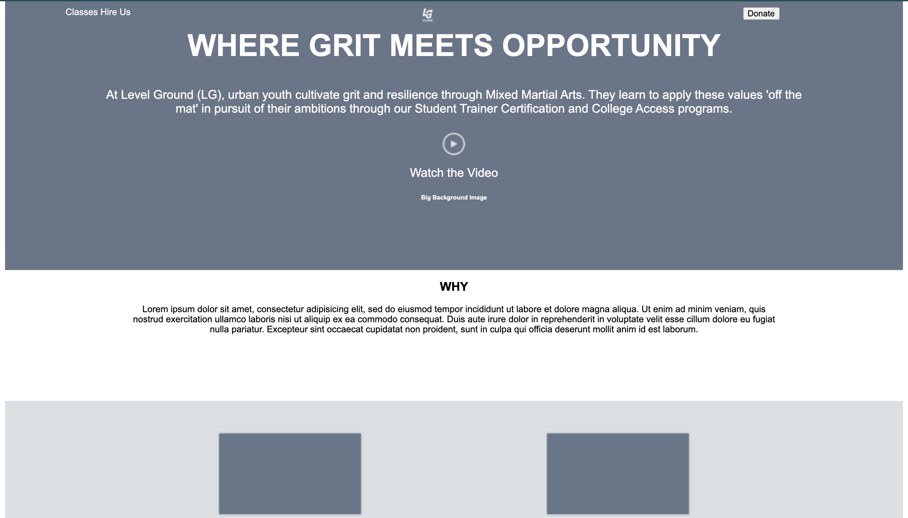

The goal of this project is to replicate the Level Ground website.

Site: [https://juliedodev-levelground.netlify.app]

How It's Made:
<ul>
<li>HTML</li>
<li>CSS</li>
</ul>

Optimizations:

Lesson Learned: The project helped me learn how to use flexbox and floats more efficiently.